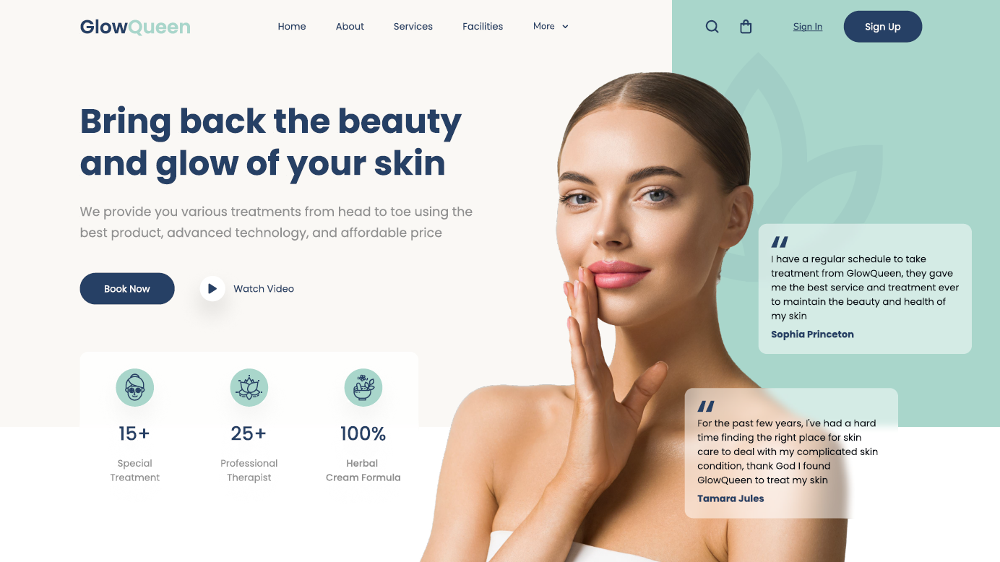

# 💆‍♀️ Spa & Beauty — CSS Assignment 1

This is a basic HTML and CSS project. It includes the **header** and **hero section** of a landing page for a **SPA & Beauty** business. The layout was created by following a PDF design provided for a school assignment.

## 🖥️ Project Preview

📎 [View on GitHub Pages](https://lorroj.github.io/spa-beauty-header/)

> This is a static (non-responsive) layout using only HTML and CSS.

## ✅ Project Requirements

- ✅ HTML5 with semantic structure
- ✅ CSS3 for visual layout based on the PDF
- ✅ Use of SVG icons
- ✅ Hover effects on buttons and links
- ✅ Accurate design matching the PDF
- ✅ Clean file and folder structure
- ✅ Deployed using GitHub Pages

## 🛠️ Technologies Used

- HTML5
- CSS3
- Google Fonts (`Poppins`)
- SVG Icons
- Git & GitHub

## 🎓 Academic Info

This project was created as part of a **CSS course assignment**. The goal was to practice layout styling from a static design using modern CSS and good HTML practices.

## 🙋 Author

**Name:** Lorenzo Rojas  
**GitHub:** [@lorroj](https://github.com/lorroj)

